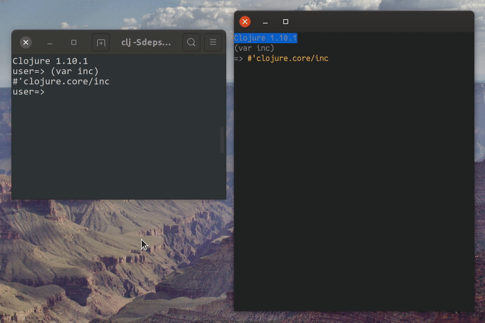

#  Reveal: Read Eval Visualize Loop for Clojure



[](https://clojars.org/vlaaad/reveal)
[](https://clojurians.slack.com/messages/reveal/)

## Rationale

I want to be able to hold a value in my hand. I want to understand it better and with fewer 
keystrokes.

Repl is a great window into a running program, but text representation is too limited for 
inspection. Reveal recognizes the value of a text as a universal interface, that's why its 
output looks like text by default: you can select it, copy it, save it into a file. It's 
not just an array of characters though: printed string representations of objects hold 
references to objects themselves, making value inspection as easy as bringing up a context 
menu.

If I want to be able to understand the values I'm looking at, the tool to do it needs to
treat these values as sacred. Where datafy-and-nav based tools like REBL pretend that 
atoms are single-element vectors, Reveal never obscures evaluation results, even the 
metadata.

Not being limited to just text, Reveal uses judicious syntax highlighting and sometimes 
simplified string representations for data to make it more approachable yet keep it 
distinctive. For example, `java.lang.Integer` has different formatting depending on 
whether it was produced from symbol or class, and function `+` is displayed as 
`clojure.core/+`, not an `#object[clojure.core$_PLUS_ 0x1e295f7f "clojure.core$_PLUS_@1e295f7f"]`, 
while still looking different from the symbol `'clojure.core/+`.


## Project status

Early Access: everything is a subject to change, lots of stuff to be implemented yet, but 
it's already a superior experience compared to repl.

## How it works

It does not depend on any particular IDE or text editor, it works in-process instead: when 
started, it will open a window where evaluation results will appear. The window supports 
both mouse and keyboard navigation. 

Context menu on selected value is opened either by pressing <kbd>Space</kbd> or by right 
mouse button click. Selecting action to run is done either with arrow keys and 
<kbd>Enter</kbd> or with a left mouse button click.

Multiple action results are shown as separate tabs in popup panel, and switching between 
those tabs is done either using mouse or using <kbd>Ctrl ←</kbd> / <kbd>Ctrl →</kbd> when 
focus is on a results panel.

## Installation and requirements

Add a dev dependency on the latest version:

[](https://clojars.org/vlaaad/reveal)

The minimum required Clojure version is `1.10`.

If you are using nrepl, just add `vlaaad.reveal.nrepl/middleware` to the middleware list. 
The minimum nrepl version is `0.6.0`.

If you are using socket repl, just run main in `vlaaad.reveal.repl` namespace.

If you don't want to use it as a repl, just call `(vlaaad.reveal.ui/make)` and it will 
open a window and return a function: call it with 1 argument to submit a value, call it 
with 0 arguments to close the window and dispose it.

## Try it out

#### As a repl in a shell

```sh
clj -Sdeps '{:deps {vlaaad/reveal {:mvn/version "0.1.0-ea9"}}}' -m vlaaad.reveal.repl
```

#### As a repl in a shell with prepl backend

```sh
clj -Sdeps '{:deps {vlaaad/reveal {:mvn/version "0.1.0-ea9"}}}' -m vlaaad.reveal.prepl
```

#### As a nrepl middleware in a shell

```sh
clj \
-Sdeps '{:deps {vlaaad/reveal {:mvn/version "0.1.0-ea9"} nrepl {:mvn/version "0.6.0"}}}' \
-m nrepl.cmdline --middleware '[vlaaad.reveal.nrepl/middleware]'
```

#### As a `tap>` target

If you don't want to use Reveal as a repl, but only want to send to it values for 
inspection, you can add a dependency on Reveal and then evaluate this:
```clj
(add-tap ((requiring-resolve 'vlaaad.reveal.ui/make)))
```

It will open a window that will receive all `tap>`-ed values while the JVM process is 
alive.

## To do
 
- text search (triggered either just by typing or with a shortcut)
  - do I need to scroll back if I want to cancel the search? yes, accidental searches should 
    be reversible!
  - jumps to first match when it's found
  - direction of search? from the cursor (or top of the screen if no cursor) in both 
    directions
  - enter/down/right to next occurrence, shift+enter/up/left to prev occurrence, esc to 
    abort search
  - starts a process that scans lines in both direction
  - what about changes to output view? new lines can be added: they need to be searched 
    too. output might be cleared for watcher views
  - an alternative can be searching one item at a time synchronously. might have bad 
    performance.
- contextual eval:
  - alt+up/down for history
  - auto-insert closing brackets
  - peek some useful ns to eval in
- more representations of objects:
  - as arbitrary JavaFx/cljfx nodes
  - url: as content, maybe even as a web page
  - directory: as file tree
  - file: as content
  - coll of maps, coll of same-length vectors: as table
  - graph-like data: as plots. see:
    - https://github.com/metasoarous/oz
    - https://github.com/jsa-aerial/hanami
    - https://vega.github.io/vega-lite/docs/selection.html#filtering-data
    - https://chart-studio.plot.ly/create/?fid=JStevens%3A2
    - > For example, I might say: "Look at that cluster of points. I wonder what they have
      in common". Then I'd drag my mouse around them, get access to the 
      datatable/vector/map/whatever datastructure of them in my REPL, and call some 
      functions on it to see if they all have some attribute or statistical property.
  - documentable things (fns, vars, keywords): as formatted documentation
  - sourceable things: as source code
- handle exceptions during streaming phase
- multiple accordions
- structural navigation
- improve datafy/nav support (on sets, for example)
- remember window position and size
- popup might appear in weird locations
- adjust scroll on opening results window
- very long lines have poor performance
- `vlaaad.reveal/-main`
- sometimes popup does not disappear
- actions and stacks of values+annotations:
  - probably instead of stack for a given selection there should be single value
  - should annotations be merged together?
